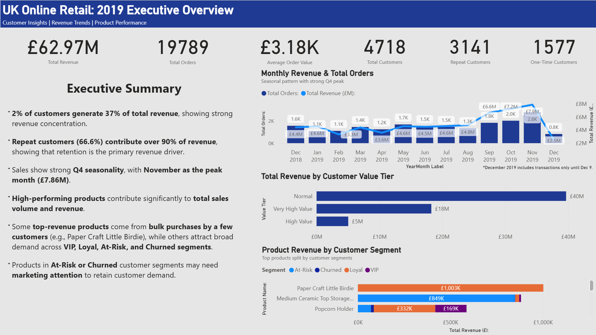

# **UK Online Retail Analysis (Dec 2018 - Dec 2019)**
**Python & Power BI | Customer, Revenue Trends & Product Performance Insights**

---

## **Project Overview**
Analyzed the **UK Online Retail 2019** dataset to uncover:
- Customer behavior and retention trends
- Monthly revenue patterns
- Product performance
- Actionable business insights

**Python**: data cleaning, EDA, statistical analysis, RFM segmentation and visualizations
**Power BI**: interactive dashboard & advanced visuals

The goal is to provide insights for marketing, inventory and operational decision-making.
---

## **Tools & Libraries**

### Python
Used for data cleaning, analysis, segmentation, and charting
- pandas 
- numpy 
- matplotlib 

### Power BI
- Interactive Dashboard for stakeholders
- DAX measures and advanced visuals
- Top products, customer segments, and monthly revenue trends

---

## **Key Objectives**
1. Analyze customer behavior and identify high value customers
2. Understand monthly revenue and sales trends
3. Analyze product performance (best & worst-selling)
4. Provide business recommendations based on the data

---

## **Methodology**
- **Step 1 - Import libraries & load dataset (Python)**: imported pandas, numpy, matplotlib, FuncFormatter; loaded dataset for analysis
- **Step 2 - Inspect, cleaning and prepare dataset (Python)**: handled missing/duplicate values, fixed incorrect entries, created necessary columns (YearMonth, Revenue, Customer_Type, etc.)
- **Step 3 - Customer Segmentation (RFM)**: classified customers as VIP, Loyal, At-Risk, Churned
- **Step 4 - Repeat Customer Analysis**: analyzed repeat vs one-time customers, monthly orders & revenue trends, visualized with bar charts & stacked area charts
- **Step 5 - Monthly Sales Trend Analysis**: dual-axis line chart for revenue & total orders, annotated key peaks/dips
- **Step 6 - Product Performance Analysis**: calculated top products, segmented into Star/Moderate/Growth/Low, visualized with pie chart & top-10 tables
- **Step 7 - Business Recommendations**: retention, marketing, inventory, conversions
- **Step 8 - Limitations & Next Steps**: noted dataset timeframe limits, missing marketing data, suggested Power BI dashboards and forecasting for the future.

---

## **Key Insights**
- **66.6% repeat customers** contribute **over 90% of revenue (£57.2M)**
- Strong **Q4 seasonality**, with **November as the peak month (£7.86M)**
- **High-performing products** contribute significantly to total sales volume and revenue
- At-Risk or Churned customer segments require targeted marketing strategies

---

## **Visualizations & Outputs**
- Bar charts: customers & revenue by type
- Stacked area charts: repeat vs one-time orders & revenue
- Dual-axis line chart: monthly revenue & total orders
- Pie chart: product segments
- CSV outputs for Power BI dashboards

---

## **Top Products (Revenue £)**
| Rank | Product | Revenue |
|------|--------|--------|
| 1    | Paper Craft Little Birdie | 1,002,718 |
| 2    | Medium Ceramic Top Storage Jar | 881,990 |
| 3    | Popcorn Holder | 587,434 |
| 4    | WWII Gliders Asstd Designs | 569,735 |
| 5    | Cream Hanging Heart T-Light Holder | 484,593 |

---

## **Key Takeaways (Business Impact & Action Plans)**
- Prioritize customer retention programs
- Plan operations around seasonal surges
- Refine the product portfolio strategy
- Re-engage vulnerable customer segments
- Invest in data-driven personalizations

## **Files Included**
- data_clean/uk_online_retail_2019_clean.csv - Cleaned dataset used for analysis
- notebooks/uk_online_retail_2019_analysis.ipynb - Python notebook with EDA, visualizations & RFM and products segmentations.
- powerbi/uk_online_retail_2019_dashboard.pbix - Interactive Power BI dashboard
- assets/ - Output charts and visualizations

---

## **Dashboard Preview**

Click on the Power BI file in the `powerbi/` folder to explore the interactive dashboard.

